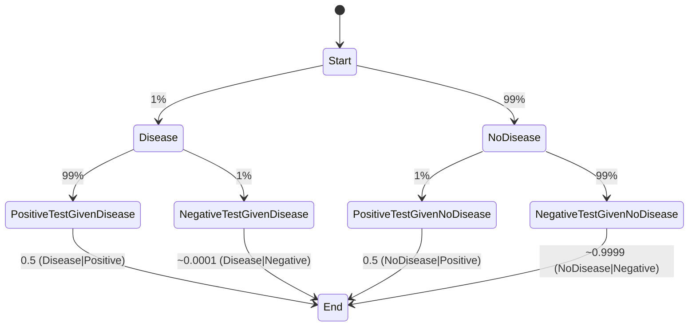

# Conditional Probability

We are often interested in know the probability of an event A given that event B has occurred. For example, what is the probability of a patient having a particular disease, given that the patient tested positive for the disease? This is known as the conditional probability of A given B and is often found in the following form based on Bayes' rule:

<p align="center">
  
</p>

P(A) is known as the prior

P(B|A) as the likelihood

P(A|B) as the posterior

 

If this conditional probability is presented simply as P(A) -- that is, 

if P(A|B) = P(A), then A and B are independent

Since knowing about B tells us nothing about the probability of *A* having also occurred.

Similarly, it is possible for A and B to be conditionally independent given the occurrence of another event C: 

P(A∩B | C) = P(A|C) P(B|C)

 

The statement above says that, given the ***C*** has occurred, knowing that  ***B *** has also occurred tells us nothing about the probability of  ***A *** having occurred.

 

If other info is available and you are asked to calculate a probability, you should always consider using Bayes' rule. It is an incredibly common interview topic, so understanding its underlying concepts and real-life applications involving it will be extremely helpful. For example, in medical testing for rare diseases, Bayes' rule is especially important, since it is may be misleading to simply diagnose someone as having a disease -- even is the test for the disease is considered "very accurate" -- without knowing the test's base rate for accuracy.

 

Bayes' rule also plays a crucial part in machine learning, where frequently, the goal is to identify the best conditional distribution for a variable given the data that is available. In and interview, hints will often be given that you need to consider Bayes' rule. One such strong hint is an interviewer's wording in directions to find the probability of some event having occurred "given that" another event has already occurred. 

--------

**Extract insights from the input information**:

**Real-world Application Scenario**:
Consider a medical test for a rare disease where:

- Only 1% of the population has the disease.
- The test has a 99% accuracy rate (meaning if you have the disease, it will detect it with 99% accuracy, and if you don't have the disease, it will correctly identify you as disease-free 99% of the time).

A patient takes the test and gets a positive result. What's the probability that they actually have the disease? This is a classic application of Bayes' rule.
I apologize for the oversight. Let's compute the probabilities for each endpoint using Bayes' Rule.

Given:
- $P(Disease) = 0.01$ (Prior probability of having the disease)
- $P(NoDisease) = 0.99$ (Prior probability of not having the disease)
- $P(PositiveTest | Disease) = 0.99$ (Likelihood of testing positive if you have the disease)
- $P(NegativeTest | Disease) = 0.01$ (Likelihood of testing negative if you have the disease)
- $P(PositiveTest | NoDisease) = 0.01$ (Likelihood of testing positive if you don't have the disease)
- $P(NegativeTest | NoDisease) = 0.99$ (Likelihood of testing negative if you don't have the disease)

Using Bayes' Rule:

1. Probability of having the disease given a positive test:
$[ P(Disease | Positive) = \frac{P(PositiveTest | Disease) \times P(Disease)}{P(PositiveTest | Disease) \times P(Disease) + P(PositiveTest | NoDisease) \times P(NoDisease)} ]$

2. Probability of having the disease given a negative test:
$[ P(Disease | Negative) = \frac{P(NegativeTest | Disease) \times P(Disease)}{P(NegativeTest | Disease) \times P(Disease) + P(NegativeTest | NoDisease) \times P(NoDisease)} ]$

3. Probability of not having the disease given a positive test:
$[ P(NoDisease | Positive) = 1 - P(Disease | Positive) ]$

4. Probability of not having the disease given a negative test:
$[ P(NoDisease | Negative) = 1 - P(Disease | Negative) ]$

Let's compute these probabilities:

1. $P(Disease | Positive) = \frac{0.99 \times 0.01}{0.99 \times 0.01 + 0.01 \times 0.99} = 0.5$
2. $P(Disease | Negative) = \frac{0.01 \times 0.01}{0.01 \times 0.01 + 0.99 \times 0.99} \approx 0.0001$
3. $P(NoDisease | Positive) = 0.5$
4. $P(NoDisease | Negative) \approx 0.9999$

Here's the updated `mermaid` state diagram with the computed probabilities:



**3. Implement the application case in code**:

```markdown
### Python Code to Calculate the Posterior Probability using Bayes' Rule:

```python
# Given probabilities
P_disease = 0.01  # Prior: Probability of having the disease
P_no_disease = 1 - P_disease  # Probability of not having the disease

P_positive_given_disease = 0.99  # Likelihood: Test accuracy for those with the disease
P_positive_given_no_disease = 0.01  # Test accuracy for those without the disease

# Using Bayes' rule to calculate the posterior probability
P_disease_given_positive = (P_positive_given_disease * P_disease) / (P_positive_given_disease * P_disease + P_positive_given_no_disease * P_no_disease)

print(f"The probability that a patient actually has the disease, given a positive test result, is: {P_disease_given_positive:.2f}")
```

This code calculates the probability that a patient actually has the disease, given a positive test result, using Bayes' rule.

```
The probability that a patient actually has the disease, given a positive test result, is: 0.50
```
