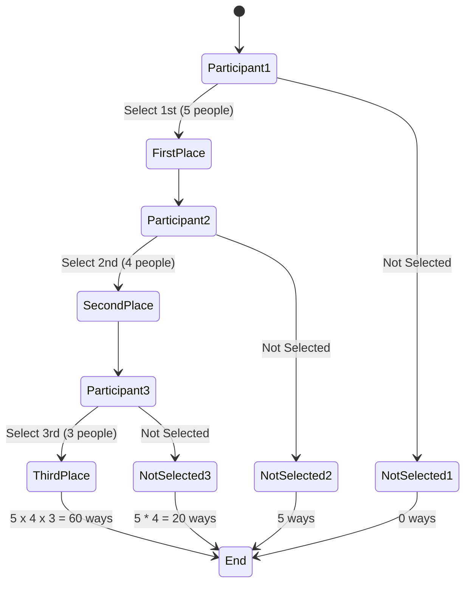
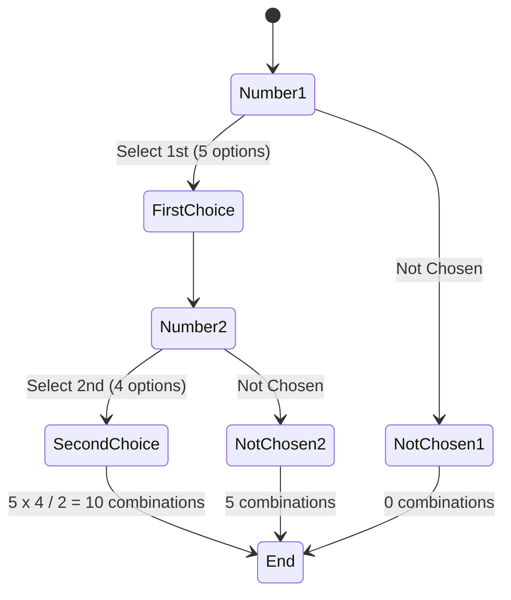

# 3. Counting

 The concept of counting typically shows up in one from or another in most interviews. Some questions may directly ask about counting(e.g.,"How many ways can five people sit around a lunch table?"), while others may ask a similar question, but as a probability (e.g.,"What is the likelihood that I draw four cards of the same suit?").
 
 Two forms of counting elements are generally relevant. If the order of selection of the *n* items being counted *k* at a time matters, then the method for counting possible permutations is employed:
$$n * (n-1) * \dots * (n-k+1) = \frac{n!}{(n-k)!}$$
 
 In contrast, if the order of selection does not matter, then the technique to count a possible number of combinations is relevant:
 $${n \choose k} = \frac{n!}{k!(n-k)!}$$
 
 Knowing these concepts is necessary in order to assess various probabilities that involve counting procedures. Therefore, remember to determine when selection does versus does not matter.
 
 For some real-time applications of both, consider making up passwords(where the order of characters matters) versus choosing restaurants nearby on a map (where order does not matter, only the options). Lastly, both permutations(排列) and combinations(组合) are frequently encountered in combinatorial and graph theory-related questions.
 
 ----

- Permutations: Used when the order of selection matters.
$$nP_k = \frac{n!}{(n-k)!}$$

- Combinations: Used when the order of selection doesn't matter.
$${n \choose k} = \frac{n!}{k!(n-k)!} $$

The examples given, such as arranging people around a table or drawing cards, are typical applications of these concepts. The real-time applications mentioned, like creating passwords (where order matters) and choosing restaurants (where order doesn't matter), are also apt.

**Real-world Application Scenario**:

## 1. **Permutations排列**:
   - **1.1Password Creation**: When creating a password using 8 different characters from a set of 26 letters, the number of possible passwords is the permutation of 26 items taken 8 at a time.
   - **1.2Race Finishing Order**: In a race with 5 participants, the number of ways the top 3 can finish is the permutation of 5 items taken 3 at a time.(如果你有5名跑步者，并且你想知道前3名可以有多少种不同的排名方式，这个过程是这样的)

### Solution for 1.2
If you only have 5 runners and you want to find the number of ways the top 3 can finish, the process is similar, but the numbers change:

1. **Choosing the 1st Place Runner**:
   - You have 5 runners to choose from for the 1st place since no one has been chosen yet.
   
2. **Choosing the 2nd Place Runner**:
   - After selecting the 1st place runner, you're left with 4 runners (because one has already finished first). So, you have 4 choices for the 2nd place.

3. **Choosing the 3rd Place Runner**:
   - Now, you've already chosen the 1st and 2nd place runners. This leaves you with 3 runners to choose from for the 3rd place.

To find out the total number of ways the top 3 positions can be filled, you multiply the number of choices at each step:

Total ways = Choices for 1st place × Choices for 2nd place × Choices for 3rd place
           = 5 × 4 × 3
           = 60 ways

So, if you have 5 runners, there are 60 different ways the top 3 runners can finish the race!


## 2. **Combinations组合**:
   - **2.1Team Selection**: If you're selecting 5 members for a team from a group of 20, the number of ways to form the team is the combination of 20 items taken 5 at a time.
   - **2.2Lottery Tickets**: In a lottery where you choose 2 numbers out of 5, the number of possible ticket combinations is the combination of 5 items taken 2 at a time.

### Solution for 2.2
Imagine you have 5 marbles numbered from 1 to 5. 

For the first choice, you can pick any of the 5 marbles. Let's say you pick the marble numbered 3. Now, for the second choice, you can't pick the marble numbered 3 again, so you only have 4 marbles left to choose from.

So, the total number of combinations is the product of the number of choices you have at each step: 5 choices for the first marble and 4 choices for the second marble. But, since the order in which you pick the marbles doesn't matter (picking 3 then 4 is the same as picking 4 then 3), you divide by 2 (the number of ways to arrange 2 marbles).



1. **Number1**: You start by choosing the first number. There are 5 options available.
2. **FirstChoice**: Once you've chosen the first number, you move to the second number.
3. **Number2**: For the second number, you can't choose the number you picked first, so you have 4 options left.
4. **SecondChoice**: After picking the second number, you've formed a combination.

Since the order in which you pick the numbers doesn't matter (picking 1 then 2 is the same as picking 2 then 1), you divide by 2 (the number of ways to arrange 2 numbers).

Mathematically, this is represented as:
Combinations = $${n \choose k} = \frac{n!}{k!(n-k)!}$$
```
Known:
n = 5 && k = 2
```
$${5 \choose 2} = \frac{5!}{2!(5-2)!}$$

$$= \frac{5 * 4 * 3 * 2 * 1}{(2 * 1) * (3 * 2 * 1)}$$

$$= 5 * 2$$

$$= 10$$

So, there are 10 possible combinations of lottery tickets you can create by choosing 2 numbers out of 5.

**3. Implement the application case in code**:

```python
import math

# Permutations: nPk = n! / (n-k)!
def permutation(n, k):
    return math.factorial(n) / math.factorial(n - k)

# Combinations: nCk = n! / (k!(n-k)!)
def combination(n, k):
    return math.factorial(n) / (math.factorial(k) * math.factorial(n - k))

# Example calculations
passwords_possible = permutation(26, 8)
race_orders = permutation(5, 3)
team_selections = combination(20, 5)
lottery_tickets = combination(5, 2)

print(f"Possible passwords: {passwords_possible}")
print(f"Possible race orders for top 3: {race_orders}")
print(f"Possible team selections: {team_selections}")
print(f"Possible lottery ticket combinations: {lottery_tickets}")
```
output:
```output
Possible passwords: 62990928000.0
Possible race orders for top 3: 60.0
Possible team selections: 15504.0
Possible lottery ticket combinations: 10.0
```

